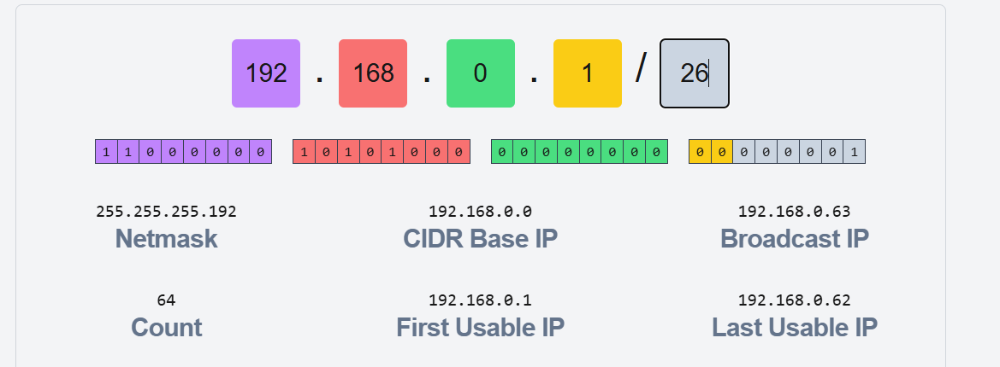
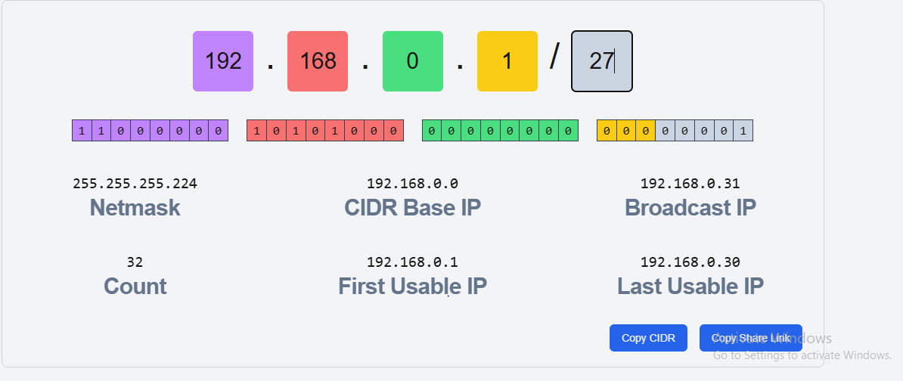
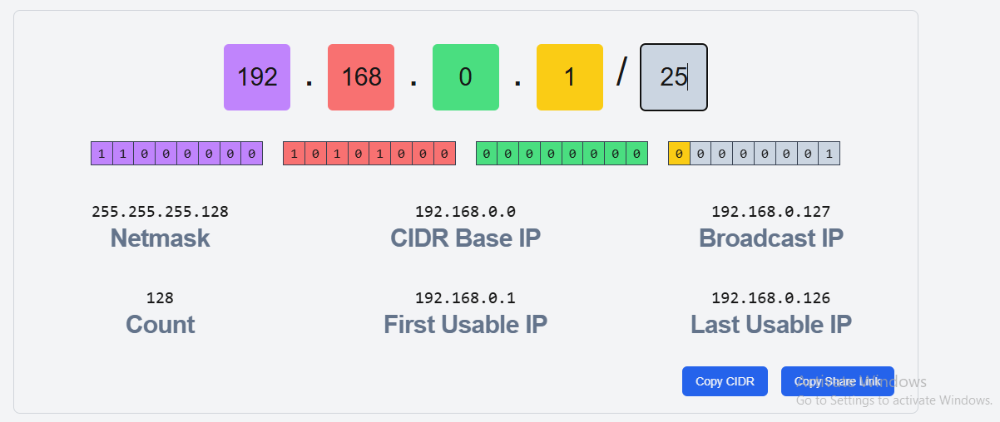
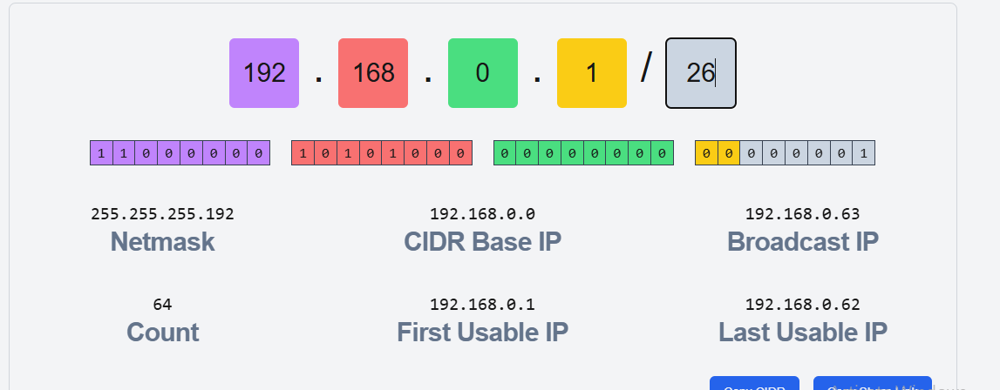
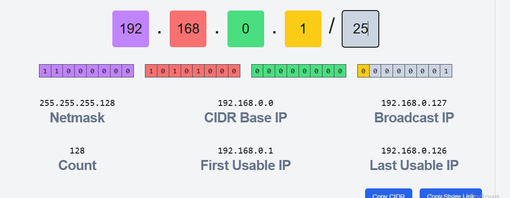
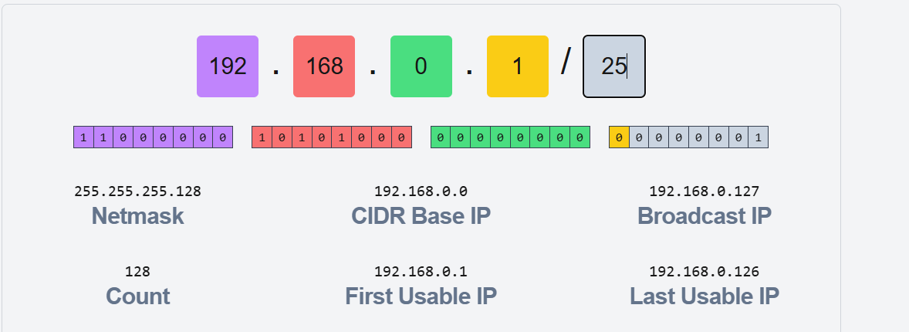

## finance

## H.R

## Sales

## Marketing

## I.T

## Operation

# 2 DOCUMENTATION

# Finance
## Subnet Mask: 255.255.255.192 
## IP Range: 192.168.0.1 – 192.168.0.126

# Human Resources
## Subnet Mask: 255.255.255.224
## IP Range: 192.168.1.193 – 192.168.1.222

# Sales
## Subnet Mask: 255.255.255.192
## IP Range: 192.168.1.1 – 192.168.1.62

# Marketing
## Subnet Mask: 255.255.255.192
## IP Range: 192.168.1.129 – 192.168.1.190

# IT 
## Subnet Mask: 255.255.255.128
## IP Range: 192.168.0.1 – 192.168.0.126

# Operations
## Subnet Mask: 255.255.255.128
## IP Range: 192.168.0.129 – 192.168.0.25